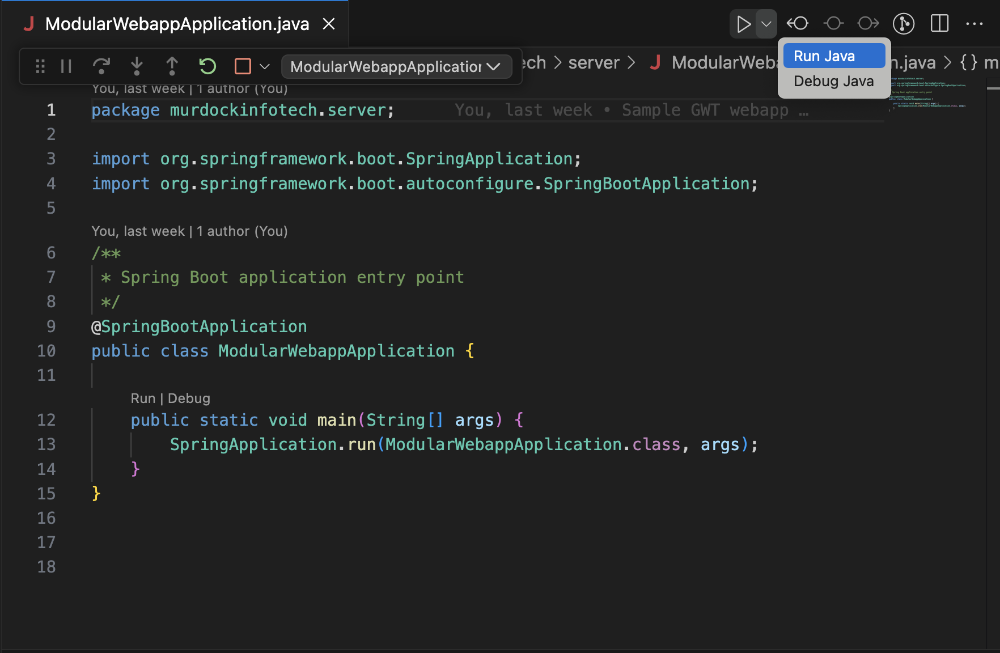

# This is a sample GWT client project used to demonstrate GWT SuperDevMode.

To start the backend, navigate to `modular-webapp-server` and run the `ModularWebApplication.java` class



To start up SuperDevMode, run the command:

- Mac/Linux: `cd modular-webapp-client && ./devModeWithParams.sh`
- Windows: `cd 'c:\Users\Sean\GWTProjects\gwt-sample\modular-webapp-client'; ./devModeWithParams.ps1`


Some key SuperDevMode parameters that are important to SuperDevMode running properly are found in `devMode.sh`. For example: 

- `-noincremental` tells SuperDevMode to do a full compile of the GWT project. This parameter removed an error that seemed to make it impossible for SuperDevMode to properly build the project.
- `-style PRETTY` tells SuperDevMode to send source code maps for debugging that are easy to read including Java variable names and values
- Invoking the GET request here: `http://localhost:9876/recompile/modularwebapp` recompiles the GWT module called modularwebapp

Another important factor for debugging is to properly configure the `.vscode/launch.json` file. This launch file creates a Chrome Browser profile that permits interactive debugging with the GWT code in VS Code. You will notice the below configuration to share source code for debugging purposes:
```
      "resolveSourceMapLocations": [
        "${workspaceFolder}/**",
        "http://localhost:9876/**",
        "http://127.0.0.1:9876/**",
        "!**/node_modules/**"
      ],
```

To use the debugger:
- click the VS Code Run menu
- click Start Debugging


- Chrome will open


- set a breakpoint in `ModularWebApp.java`


- reload the page


- variables and debugging buttons are visible

