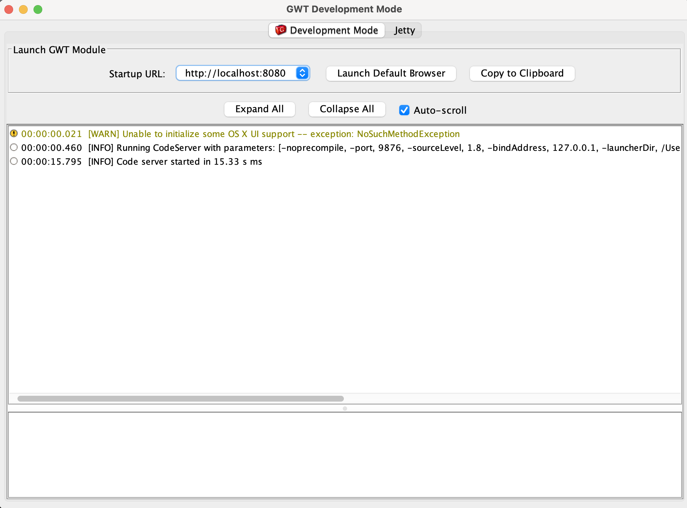
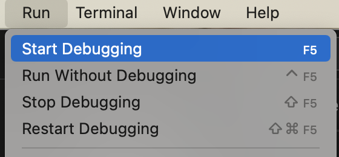
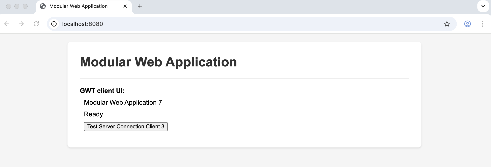
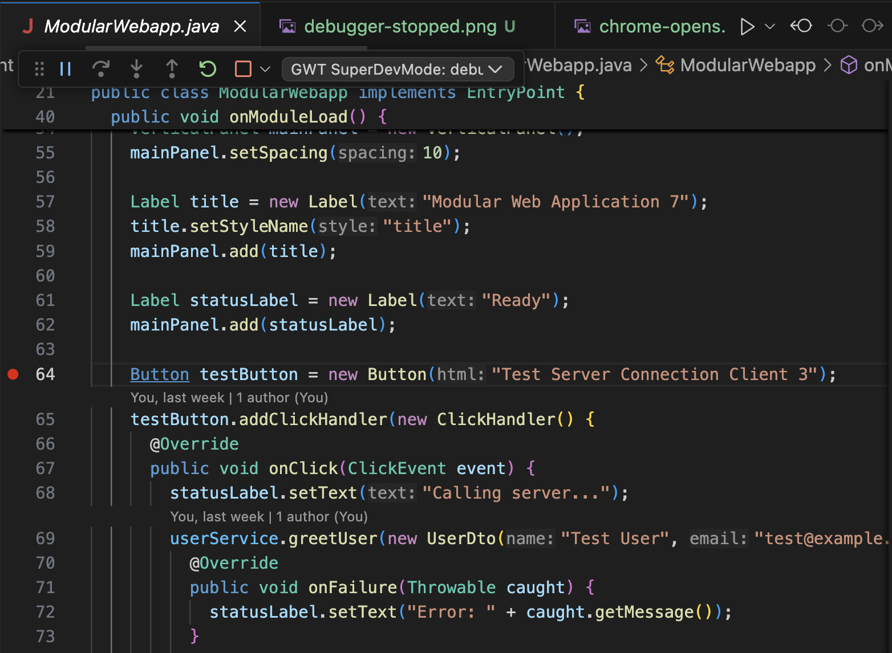
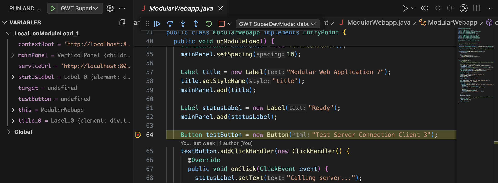

# This is a sample GWT client project used to demonstrate GWT SuperDevMode using VS Code or Cursor.

The next goal is to implement a [VS Code extension](https://docs.google.com/document/d/1fX_2zoNj3UByTINpmZn81nQ6vR0avS2eFlQSSqKD14s/edit?usp=sharing) that leverages the same functionality with minimal project configuration and remove manual recompiles: 

To start the backend (Jetty), see the backend README: [`../modular-webapp-server/README.md`](../modular-webapp-server/README.md)

To start up SuperDevMode (CodeServer :9876), use the VS Code/Cursor **Run and Debug** launch configuration:

- Open the **Run and Debug** view:
  - macOS: `SHIFT CMD D`
  - Windows/Linux: `SHIFT CTRL D`
- Select and start: **`GWT CodeServer (:9876)`**

Alternatively, you can start CodeServer from the command line:

- Mac/Linux: `cd modular-webapp-client && ./devModeWithParams.sh`
- Windows: `cd modular-webapp-client; ./devModeWithParams.ps1`



Some key SuperDevMode parameters that are important to SuperDevMode running properly are found in `devMode.sh and devMode.ps1`. For example: 

- `-noincremental` tells SuperDevMode to do a full compile of the GWT project. This parameter removed an error that seemed to make it impossible for SuperDevMode to properly build the project.
- `-style PRETTY` tells SuperDevMode to send source code maps for debugging that are easy to read including Java variable names and values
- Invoking the GET request here: `http://localhost:9876/recompile/modularwebapp` recompiles the GWT module called modularwebapp

## Auto-recompile on file changes (macOS bash + PowerShell)

The CodeServer recompile endpoint can be invoked automatically whenever files change in:
- `modular-webapp-client/src/main/java`
- `modular-webapp-shared/src/main/java`

### macOS (bash)

Prereqs:
- `fswatch` (`brew install fswatch`)

Run in a second terminal:
- `cd modular-webapp-client && ./autoRecompile.sh`

Notes:
- **Linux is not supported yet** for bash auto-recompiles.

### PowerShell (Windows/macOS/Linux)

Run in a second terminal:
- `cd modular-webapp-client; pwsh ./autoRecompile.ps1`

Another important factor for debugging is to properly configure the `.vscode/launch.json` file. This launch file creates a Chrome Browser profile that permits interactive debugging with the GWT code in VS Code. You will notice the below configuration to share source code for debugging purposes:
```
      "resolveSourceMapLocations": [
        "${workspaceFolder}/**",
        "http://localhost:9876/**",
        "http://127.0.0.1:9876/**",
        "!**/node_modules/**"
      ],
```

To use the debugger:
- Mac/Linux: `SHIFT CMD D` 
- Windows: `SHIFT CTRL D`
- click Start Debugging




- Chrome will open



- set a breakpoint in `ModularWebApp.java`



- reload the page


- variables and debugging buttons are visible


