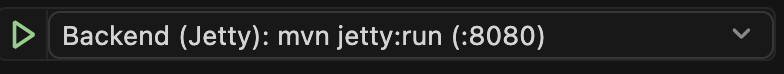
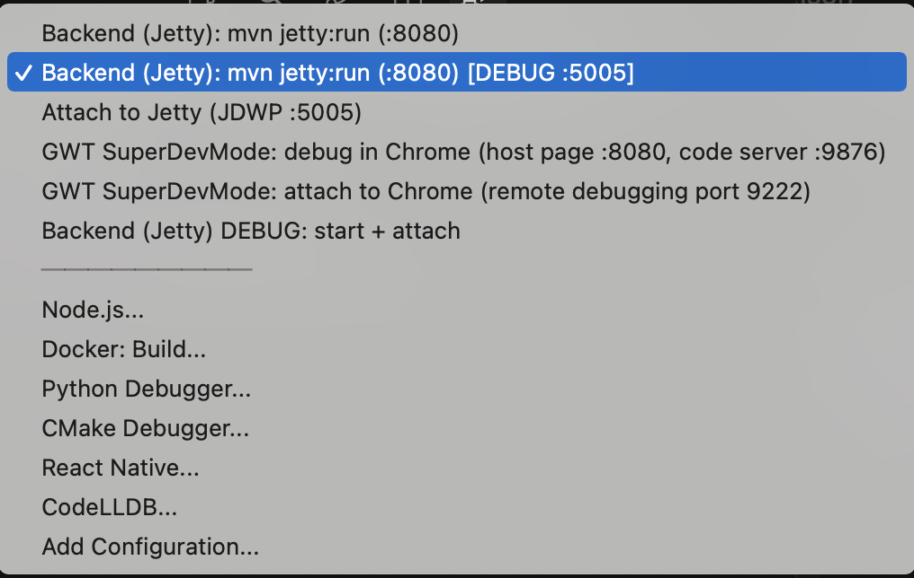
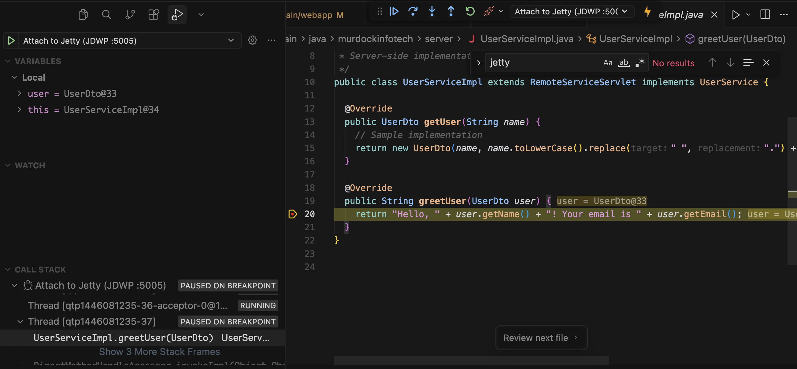
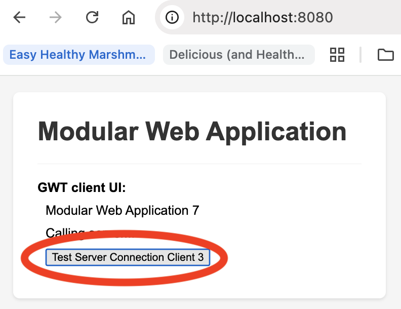
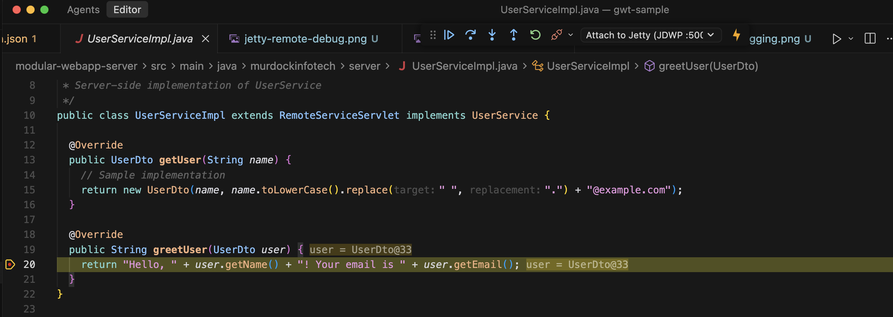

# Server (Jetty) Debugging (VS Code)

This module runs the backend on Jetty and supports **remote debugging via JDWP** (port **5005**).

## Debug flow (backend breakpoint in Java)

1. Open VS Code’s **Run and Debug** view:
   - macOS: **Cmd + Shift + D**
   - Windows/Linux: **Ctrl + Shift + D**

2. Click the **debug configuration dropdown** and select:
   - `Backend (Jetty): mvn jetty:run (:8080) [DEBUG :5005]`

3. Confirm you selected the “Jetty with remote debugging” configuration:

4. Start the debug session (then attach the Java debugger if prompted/needed):
   - `Attach to Jetty (JDWP :5005)`
   - (Optional) `Backend (Jetty) DEBUG: start + attach` (compound)

5. In the browser UI, click the **Test Server Connection** button:

6. Your Java breakpoint should hit (example shown in `UserServiceImpl.greetUser(...)`):

